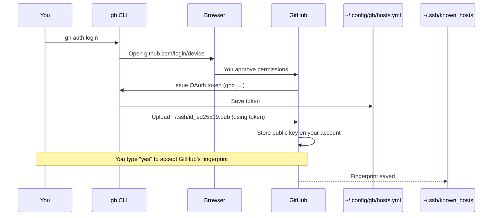
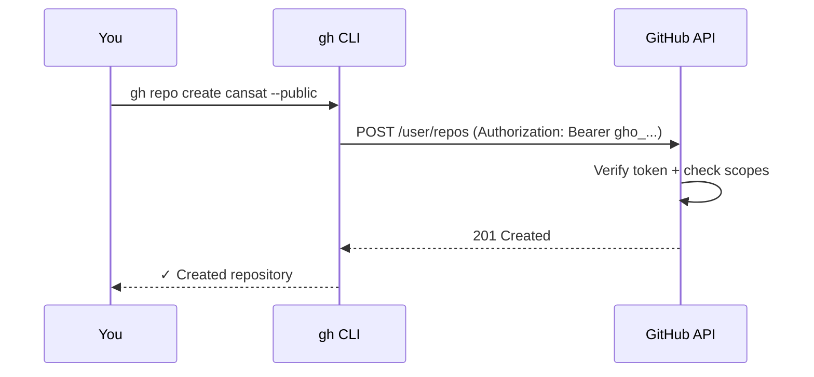
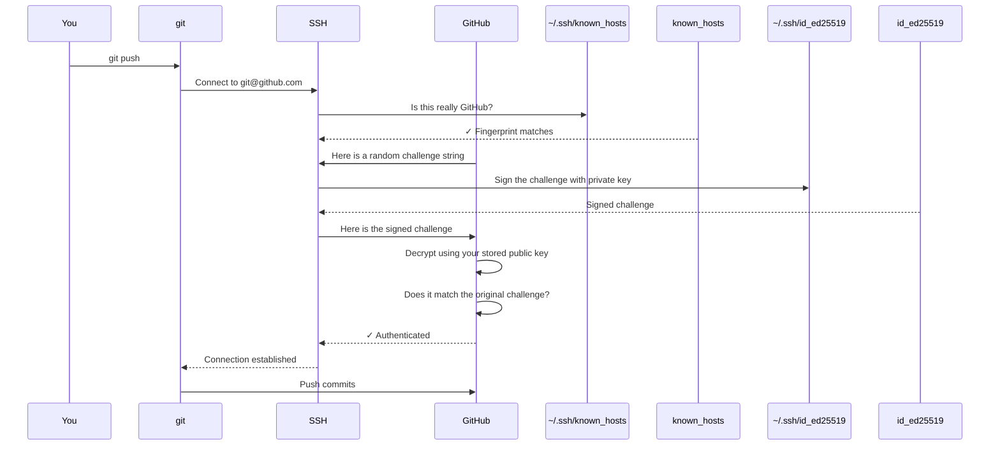
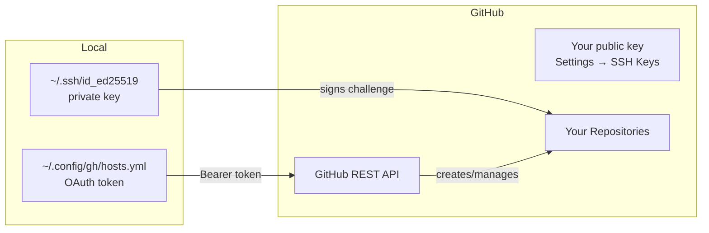

# GitHub Authentication Explainer

## What Lives Where

### On Your Machine (WSL)

| File | Purpose |
|---|---|
| `~/.ssh/id_ed25519` | Your **private key** — never leaves this machine |
| `~/.ssh/id_ed25519.pub` | Your **public key** — shared with GitHub |
| `~/.ssh/known_hosts` | GitHub's fingerprint — proves you're talking to the real GitHub |
| `~/.config/gh/hosts.yml` | OAuth token + SSH protocol setting for github.com |
| `~/.config/gh/config.yml` | `gh` CLI general settings |
| `~/.gitconfig` | Your git identity (name, email) |

### On GitHub

| What | Where on GitHub |
|---|---|
| Your public key | Settings → SSH and GPG keys |
| Your OAuth token | Settings → Applications → Authorized OAuth Apps |
| Your repos | github.com/your-username |

---

## The Key Pair

The SSH key pair is based on **asymmetric cryptography (Ed25519)**. The two keys are mathematically linked:

```
Private key  →  (one-way mathematical function)  →  Public key
```

- You can derive the public key from the private key
- You **cannot** derive the private key from the public key
- Data signed with the private key can be verified with the public key

---

## One-Time Setup: `gh auth login`



After this step:
- `gh` can talk to the GitHub API using the OAuth token
- `git` can push/pull over SSH using your key pair

---

## Every `gh` CLI Command (e.g. `gh repo create`)



The OAuth token is sent as a header on every API request. GitHub checks:
1. Is the token valid?
2. Does it have the required scope for this action?

---

## Every `git push` / `git pull`



### Why This Is Secure

An attacker watching the network sees:
- The challenge (random string, useless without the private key)
- The signed challenge (can't be reversed to get the private key)
- Your public key (already public, useless on its own)

The private key **never leaves `~/.ssh/id_ed25519`**.

---

## Summary: Two Separate Auth Systems



| | SSH Key Pair | OAuth Token |
|---|---|---|
| Used for | `git push` / `git pull` | `gh` CLI commands |
| Stored locally | `~/.ssh/id_ed25519` | `~/.config/gh/hosts.yml` |
| Stored on GitHub | Settings → SSH Keys | Authorized OAuth Apps |
| How it authenticates | Cryptographic challenge/response | Bearer token in HTTP header |
| Generated by | `gh auth login` (or manually) | `gh auth login` browser flow |
